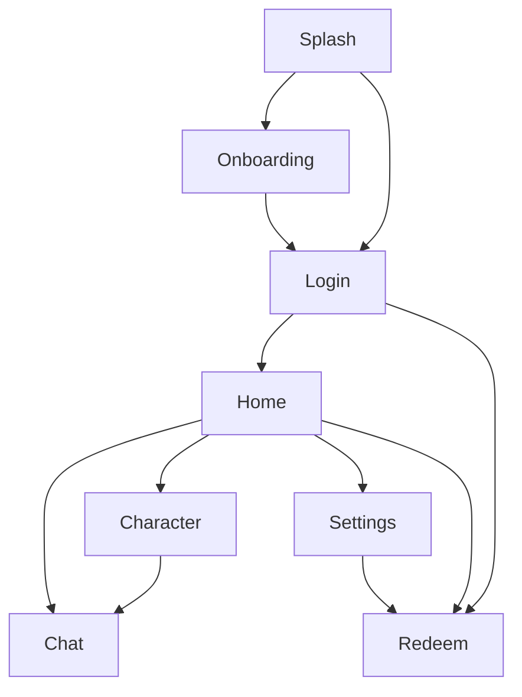

# 07 Navigation Flow — 页面流转

## 1. 主流程

说明：

- 已登录用户：`Splash -> Home`
- 未登录且首次启动：`Splash -> Onboarding -> Login -> Home`
- 未登录且非首次启动：`Splash -> Login -> Home`

## 2. 页面级转场

| 来源 | 去向 | 动画 | 时长 |
|---|---|---|---:|
| Splash | Onboarding / Login / Home | Fade | `320ms` |
| Onboarding Step N | Step N+1 | Horizontal Slide | `280ms` |
| Onboarding Step 3 | Login / Home | Fade + Up | `300ms` |
| Login | Home | Fade + Up | `300ms` |
| Login | Redeem | Push | `300ms` |
| Home | Chat | Push | `300ms` |
| Home | Character | Push | `300ms` |
| Home | Settings | Push | `300ms` |
| Home | Redeem | Push | `300ms` |
| Character | Chat | Push | `300ms` |
| Any Child Page | Back | Pop | `300ms` |

## 3. 返回规则

- Chat：返回 Home 或会话来源页
- Character：返回 Home；点击“确认选择”后，如果来自聊天前置选择，则进入 Chat
- Settings：返回上一页；不得直接跳根页，除非无历史栈
- Redeem：返回来源页；来源为 Login 时回 Login，来源为 Settings 时回 Settings
- Onboarding：Step 1 不显示返回；Step 2/3 返回到上一步，不直接退出流程

## 4. TabBar 规则

- Home、Chat、Character、Settings 属于同一主导航层级
- Tab 切换使用主导航切页，不使用模态覆盖
- 当前激活 Tab 必须在视觉上保持唯一高亮

## 5. 禁止事项

- 不允许把子页面改成弹窗页
- 不允许把主流程跳过登录直接进 Home
- 不允许把 Chat 从 Push 改成 BottomSheet 式进入
- 不允许更改返回优先级
